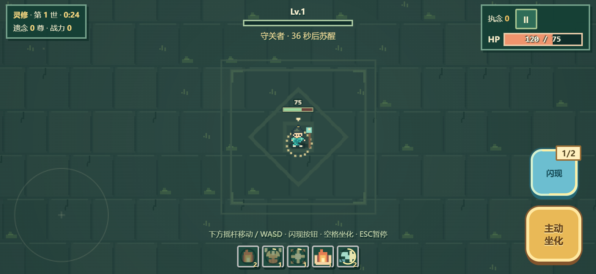
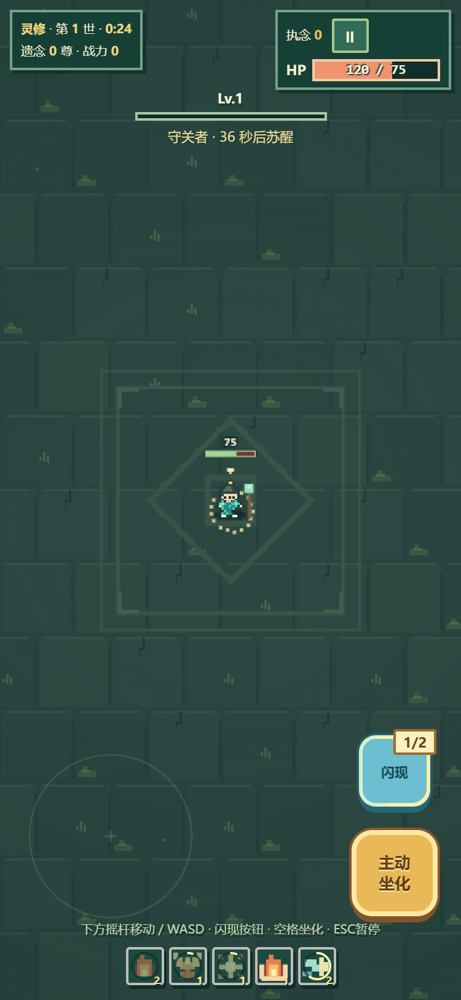

# 轮回沙场 · 苔庭遗梦

**浏览器像素风生存肉鸽游戏。每一世留下遗念，与你历代的自己并肩迎战。**

> **[在线开始游戏](https://fklearning.github.io/lunhui-arena/)**

## 游戏简介

《轮回沙场》是一款无需安装、可在现代浏览器游玩的像素风生存游戏。选择灵修或体修，在苔石遗迹中移动、自动战斗、收集经验并强化技能。每轮结束后，前世会留下遗念，与后续轮回并肩作战；大轮回可结算轮回印，用于永久强化。

## 操作方式

- 电脑：WASD / 方向键移动，F 闪现，空格主动坐化，Esc 或 P 暂停；角色会自动攻击。
- 手机：建议横屏游玩；左下摇杆移动，右侧按钮闪现和主动坐化，右上暂停。
- 首页可打开「沙场手记」查看新手指引。

进度保存在当前浏览器中，不会在不同浏览器或设备间自动同步。

## 项目信息

- 当前版本：v0.9.8
- 入口：`index.html`（游戏与 CSS、JavaScript 都在此文件内）
- 发布类型：纯静态 HTML，无需构建命令、npm 或后端服务。
